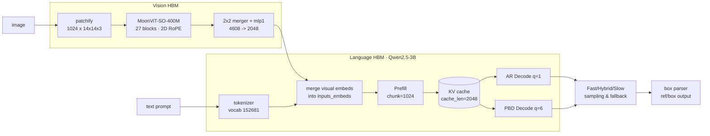

<div align="center">


# LocateAnything on D-Robotics S600

Edge deployment of NVIDIA's LocateAnything-3B grounding VLM on the D-Robotics S600 BPU, preserving the model's Parallel Block Decoding (PBD), native MoonViT vision encoder, and full 152,681-token vocabulary.

[](LICENSE)
[](#)
[](#)
[](https://huggingface.co/nvidia/LocateAnything-3B)
[](#)

**English** · [中文](README.zh-CN.md)

</div>

---

## Overview

LocateAnything-3B is NVIDIA's grounding-capable vision-language model based on MoonViT-SO-400M and a Qwen2.5-3B decoder trained for Parallel Block Decoding of `<box>x1 y1 x2 y2</box>` structures. This repository ports it to the D-Robotics S600 BPU via the OELLM 1.0.5 toolchain, producing standalone HBM artifacts for the vision and language stages.

Design choices:

- Vendored MoonViT-SO-400M vision encoder (27 layers, 2D RoPE) rather than substituting Qwen2.5-VL's ViT.
- Full 152,681-token vocabulary, including the `<0>`–`<1000>` coordinate tokens and `<ref>`/`<box>` structural anchors.
- PBD block size 6 exposed to the compile CLI as `--decode_seq_len 6`; the Language HBM exports `decode` (PBD q=6) and `decode_ar` (q=1) for Fast/Hybrid/Slow runtime modes.
- Independent `locateanything-3b` model family under `toolchain/leap_llm/models/locateanything/`, registered in `model_factory.py` alongside the upstream builders. Runtime imports do not touch `qwen2_5_vl`.

Current status (2026-07-18): the self-compiled Qwen2.5-VL-3B baseline is
validated on S600. LocateAnything Fix #011 has passed checkpoint loading,
hidden-domain equivalence, and Language/Vision BC export. Fresh HBM compilation
and board-side semantic validation are the next gates; older LA HBMs are RCA
artifacts, not release models.

## Architecture



## Quickstart

Current compiler guide: [docs/tutorials/LOCATEANYTHING_COMPILATION.md](docs/tutorials/LOCATEANYTHING_COMPILATION.md).

```bash
git clone https://github.com/LiuAnclouds/oe_locateanything.git
cd oe_locateanything
git clone https://github.com/NVlabs/Eagle.git eagle

# Environment setup — see docs/DEPLOYMENT.md
#   conda env: locateanything (PyTorch baseline)
#   conda env: oellm          (OELLM S600 compile toolchain)

# Validate BC first, then launch detached HBM compiles.
EXPORT_ONLY=1 ./main/scripts/compile_locateanything_language.sh
./main/scripts/compile_locateanything_language.sh
./main/scripts/compile_locateanything_vit.sh
```

## Model Specification

| Component | Value |
|---|---|
| Vision encoder | MoonViT-SO-400M · 27 layers · hidden 1152 · patch 14 |
| Projector | 2-layer MLP · 4608 → 2048 |
| Language model | Qwen2.5-3B decoder · 36 layers · hidden 2048 · KV heads 2 (GQA) |
| Vocabulary | 152,681 tokens |
| PBD block | 6 tokens |
| Output format | `<ref>label</ref><box>x1 y1 x2 y2</box>` |
| Total parameters | 3.83 B (LM 3.40 B + MoonViT 0.42 B + projector 0.014 B) |

## Performance

| Stage | HBM size | S600 latency | Status |
|---|---|---|---|
| Vision BC (MoonViT + projector) | — | — | Fix #011 export passed |
| Language prefill BC (chunk 1024) | — | — | Fix #011 export passed |
| Language decode PBD BC (q=6) | — | — | Fix #011 export passed |
| Language decode AR BC (q=1) | — | — | Fix #011 export pending recheck |
| Fresh Fix #011 HBMs | TBA | TBA | compiling / pending validation |

## Roadmap

- [x] M0 — OELLM baseline dry-run (`qwen2_5-vl-3b`)
- [x] M1 — PBD `decode_seq_len=6` wired through the compile CLI
- [x] M2 — LocateAnything language Leap graph (independent, PBD-aware)
- [x] M3-α — MoonViT vision leap DSL vendored and sanity-verified
- [x] M3-β — Vision and Language BC export with shared hidden domain
- [ ] M3-γ — Fresh Fix #011 HBM compile and numerical validation
- [ ] M4 — Unified `locateanything-3b` builder (vision + language in one run)
- [ ] M5 — Host runtime: visual embed merge + PBD/Hybrid sampling + box parser
- [ ] M6 — Precision alignment (HBM ↔ PyTorch baseline logits)
- [ ] M7 — S600 end-to-end benchmark on grounding suites

## Documentation

| Document | English | 中文 |
|---|---|---|
| Deployment guide | [docs/DEPLOYMENT.md](docs/DEPLOYMENT.md) | [docs/DEPLOYMENT.zh-CN.md](docs/DEPLOYMENT.zh-CN.md) |
| Runtime architecture (host + BPU split) | [docs/RUNTIME_ARCHITECTURE.md](docs/RUNTIME_ARCHITECTURE.md) | — |
| Upstream source review | [docs/SOURCE_REVIEW.md](docs/SOURCE_REVIEW.md) | — |
| LA compilation | [docs/tutorials/LOCATEANYTHING_COMPILATION.md](docs/tutorials/LOCATEANYTHING_COMPILATION.md) | — |
| Qwen baseline | [docs/tutorials/QWEN2_5_VL_BASELINE.md](docs/tutorials/QWEN2_5_VL_BASELINE.md) | — |
| S600 runtime and sync | [docs/tutorials/S600_RUNTIME.md](docs/tutorials/S600_RUNTIME.md) | — |
| Deployment workspace layout | [main/README.md](main/README.md) | — |
| D-Robotics S600 SDK placement | [oellm/README.md](oellm/README.md) | — |

## Repository Layout

```
oe_locateanything/
├── assets/                     visual assets
├── baselines/qwen2_5_vl/       validated Qwen compiler baseline and RCA inputs
├── docs/                       user-facing documentation (EN / 中文)
├── main/                       deployment artifacts
│   ├── examples/               PyTorch baseline & HBM verification
│   ├── scripts/                compile / benchmark scripts
│   ├── configs/                runtime configs
│   ├── outputs/                compiled artifacts (git-ignored)
│   └── logs/                   build / verification logs (git-ignored)
├── toolchain/                  vendored OELLM leap_llm source
│   └── leap_llm/models/locateanything/   independent LocateAnything module
├── oellm/                      S600 SDK placement (git-ignored)
├── eagle/                      LocateAnything source clone (git-ignored)
├── LICENSE                     CC BY-NC 4.0
├── AUTHORS
├── README.md                   (English)
└── README.zh-CN.md             (中文)
```

## Citation

```bibtex
@misc{locateanything2025,
  title  = {LocateAnything},
  author = {NVIDIA},
  year   = {2025},
  url    = {https://huggingface.co/nvidia/LocateAnything-3B}
}

@misc{oe_locateanything2026,
  title  = {oe\_locateanything: LocateAnything-3B PBD Deployment on D-Robotics S600},
  author = {Xu, Kangjie},
  year   = {2026},
  url    = {https://github.com/LiuAnclouds/oe_locateanything}
}
```

## Acknowledgements

- [NVIDIA Eagle team](https://github.com/NVlabs/Eagle) for LocateAnything-3B.
- [Moonshot AI](https://github.com/MoonshotAI) for MoonViT-SO-400M.
- [Qwen team](https://github.com/QwenLM/Qwen2.5) for the Qwen2 decoder.
- [D-Robotics](https://d-robotics.cc/) for the S600 platform and OELLM 1.0.5 toolchain.

## License

Licensed under [Creative Commons Attribution-NonCommercial 4.0 International (CC BY-NC 4.0)](LICENSE). Free for research, teaching, and personal use. Commercial use requires a separate agreement.

Copyright © 2026 [LiuAnclouds](https://github.com/LiuAnclouds) · Kangjie Xu · D-Robotics.

Upstream components (LocateAnything model weights, MoonViT weights, D-Robotics OELLM SDK, vendored `leap_llm` source under `toolchain/`) retain their original licenses.
