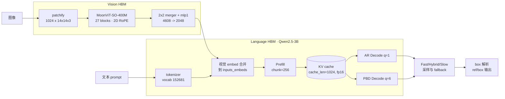

<div align="center">


# LocateAnything · 地瓜 S600 端侧部署

将 NVIDIA LocateAnything-3B 视觉定位大模型端到端部署到 D-Robotics S600 BPU，保留其并行块解码 (PBD)、MoonViT 视觉编码器与完整 152,681 词表。

[](LICENSE)
[](#)
[](#)
[](https://huggingface.co/nvidia/LocateAnything-3B)
[](#)

[English](README.md) · **中文**

</div>

---

## 项目概述

LocateAnything-3B 是 NVIDIA 发布的具备视觉定位能力的视觉语言模型，采用 MoonViT-SO-400M 视觉编码器与 Qwen2.5-3B 语言解码器，通过并行块解码 (Parallel Block Decoding, PBD) 一次生成 `<box>x1 y1 x2 y2</box>` 结构。本仓库基于 D-Robotics OELLM 1.0.5 工具链，将其端到端部署到 S600 BPU，产出独立的视觉与语言 HBM 产物。

设计选择：

- 复用 MoonViT-SO-400M 视觉编码器 (27 层, 2D RoPE)，不替换为 Qwen2.5-VL 的 ViT。
- 保留完整 152,681 词表，包括 `<0>`–`<1000>` 坐标 token 与 `<ref>` / `<box>` 结构锚点。
- PBD block size 6 通过 `--decode_seq_len 6` 暴露给编译 CLI，同时生成 AR (q=1) 与 PBD (q=6) 两个 decode 图，供 Host runtime 的 Fast / Hybrid / Slow 模式使用。
- 独立的 `locateanything-3b` 模型家族位于 `toolchain/leap_llm/models/locateanything/`，通过 `model_factory.py` 与官方 builder 并列注册。runtime 不依赖 `qwen2_5_vl`。

## 架构



## 快速开始

完整分步指南：[docs/DEPLOYMENT.md](docs/DEPLOYMENT.md)。

```bash
git clone https://github.com/LiuAnclouds/oe_locateanything.git
cd oe_locateanything
git clone https://github.com/NVlabs/Eagle.git eagle

# 环境准备 — 详见 docs/DEPLOYMENT.md
#   conda env: locateanything (PyTorch baseline)
#   conda env: oellm          (OELLM S600 编译工具链)

# 编译 language HBM (16 核 CPU + 1x RTX 4090 大约 3-4 小时)
oellm_build \
  --model_name locateanything-lm-3b \
  --march nash-p \
  --input_model_path eagle/Embodied/LocateAnything-3B \
  --output_model_path main/language/baseline_outputs/locateanything-lm-3b_nash-p_w4 \
  --w_bits 4 --chunk_size 256 --cache_len 1024 --decode_seq_len 6 \
  --device cuda:0 --prefill_core_num 4 --decode_core_num 4 --jobs 16
```

## 模型规格

| 模块 | 配置 |
|---|---|
| 视觉编码器 | MoonViT-SO-400M · 27 层 · hidden 1152 · patch 14 |
| Projector | 2-layer MLP · 4608 → 2048 |
| 语言模型 | Qwen2.5-3B decoder · 36 层 · hidden 2048 · KV heads 2 (GQA) |
| 词表 | 152,681 tokens |
| PBD block | 6 tokens |
| 输出格式 | `<ref>label</ref><box>x1 y1 x2 y2</box>` |
| 参数量总计 | 3.83 B (LM 3.40 B + MoonViT 0.42 B + projector 0.014 B) |

## 性能

| 阶段 | HBM 大小 | S600 延迟 | 状态 |
|---|---|---|---|
| Vision (MoonViT + projector) | 待定 | 待定 | M3-β |
| Language prefill (chunk 256) | 待定 | 待定 | M2 |
| Language decode AR (q=1) | 待定 | 待定 | M2 |
| Language decode PBD (q=6) | 待定 | 待定 | M2 |

## Roadmap

- [x] M0 — OELLM baseline dry-run (`qwen2_5-vl-3b`)
- [x] M1 — PBD `decode_seq_len=6` 参数打通编译 CLI
- [x] M2 — LocateAnything language HBM (独立 leap DSL, 支持 PBD)
- [x] M3-α — MoonViT vision leap DSL 独立化, sanity 通过
- [ ] M3-β — Vision HBM 编译
- [ ] M4 — 统一 `locateanything-3b` builder (vision + language 一次编译)
- [ ] M5 — Host runtime: 视觉 embed 合并 + PBD/Hybrid 采样 + box 解析
- [ ] M6 — 精度对齐 (HBM ↔ PyTorch baseline logits)
- [ ] M7 — S600 端到端 grounding benchmark

## 文档

| 文档 | English | 中文 |
|---|---|---|
| 部署指南 | [docs/DEPLOYMENT.md](docs/DEPLOYMENT.md) | [docs/DEPLOYMENT.zh-CN.md](docs/DEPLOYMENT.zh-CN.md) |
| 运行时架构 (host + BPU 分层) | [docs/RUNTIME_ARCHITECTURE.md](docs/RUNTIME_ARCHITECTURE.md) | — |
| 部署工作目录说明 | [main/README.md](main/README.md) | — |
| D-Robotics S600 SDK 存放说明 | [oellm/README.md](oellm/README.md) | — |

## 仓库结构

```
oe_locateanything/
├── assets/                     静态资源
├── docs/                       用户文档 (EN / 中文)
├── main/                       部署工件
│   ├── examples/               PyTorch baseline 与 HBM 验证
│   ├── scripts/                编译 / benchmark 脚本
│   ├── configs/                runtime 配置
│   ├── outputs/                编译产物 (git-ignored)
│   └── logs/                   构建与验证日志 (git-ignored)
├── toolchain/                  vendored OELLM leap_llm 源码
│   └── leap_llm/models/locateanything/   独立 LocateAnything 模块
├── oellm/                      S600 SDK 存放位置 (git-ignored)
├── eagle/                      LocateAnything 源码 clone (git-ignored)
├── LICENSE                     CC BY-NC 4.0
├── AUTHORS
├── README.md                   (English)
└── README.zh-CN.md             (中文)
```

## Citation

```bibtex
@misc{locateanything2025,
  title  = {LocateAnything},
  author = {NVIDIA},
  year   = {2025},
  url    = {https://huggingface.co/nvidia/LocateAnything-3B}
}

@misc{oe_locateanything2026,
  title  = {oe\_locateanything: LocateAnything-3B PBD Deployment on D-Robotics S600},
  author = {Xu, Kangjie},
  year   = {2026},
  url    = {https://github.com/LiuAnclouds/oe_locateanything}
}
```

## 致谢

- [NVIDIA Eagle team](https://github.com/NVlabs/Eagle) — LocateAnything-3B。
- [Moonshot AI](https://github.com/MoonshotAI) — MoonViT-SO-400M。
- [Qwen team](https://github.com/QwenLM/Qwen2.5) — Qwen2 decoder。
- [D-Robotics](https://d-robotics.cc/) — S600 平台与 OELLM 1.0.5 工具链。

## License

采用 [Creative Commons Attribution-NonCommercial 4.0 International (CC BY-NC 4.0)](LICENSE) 许可。可免费用于研究、教学与个人用途；商业使用需另行获得授权。

Copyright © 2026 [LiuAnclouds](https://github.com/LiuAnclouds) · Kangjie Xu · D-Robotics.

上游组件 (LocateAnything 权重、MoonViT 权重、D-Robotics OELLM SDK、`toolchain/` 下 vendored 的 `leap_llm` 源码) 沿用其原有许可。
